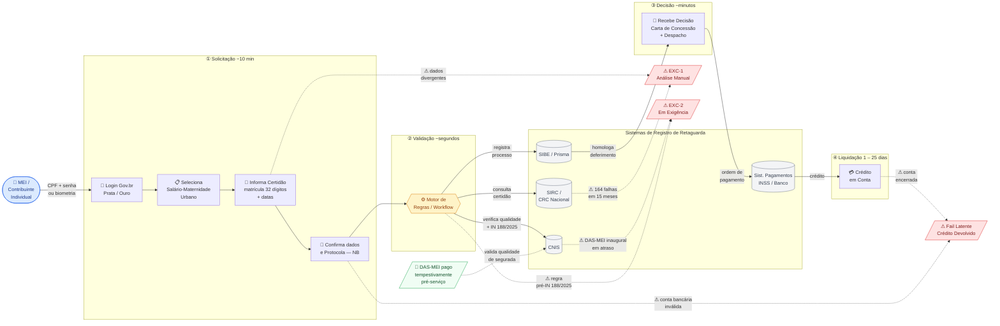

# Diagrama AS-IS — Salário-Maternidade Urbano (MEI / Contribuinte Individual)

**Leitura:** fluxo da esquerda para a direita, agrupado em quatro fases lógicas.
Linhas sólidas = fluxo nominal (happy path). Linhas tracejadas = falhas e desvios.
Nós em losango com borda = fail points sinalizados no Blueprint (`C_blueprint_asis.md`).

---

---

## Legenda de Cores e Formas

| Elemento | Cor | Significado |
|---|---|---|
| 👤 Oval azul | `#dbeafe` | Cidadã (persona focal — MEI / Contribuinte Individual) |
| 📄 Losango verde | `#f0fdf4` | Input pré-serviço (DAS-MEI — fora do escopo temporal) |
| ⚙ Hexágono amarelo | `#fef3c7` | Motor de Regras / Workflow (Backstage — Tecnologia Ativa) |
| 🗄 Cilindro cinza | `#f3f4f6` | Sistemas de Registro de Retaguarda (CNIS, SIRC, SIBE) |
| ⚠ Losanco vermelho | `#fee2e2` | Fail point — porta de saída para Blueprint de Exceção |
| → Linha sólida | — | Fluxo nominal do happy path |
| -.-> Linha tracejada | — | Desvio por falha ou conexão assíncrona de pré-condição |

## Relações-Chave Evidenciadas

| Relação | Tipo | Descrição |
|---|---|---|
| MEI → Motor (via E1–E4) | Indireta / mediada | A cidadã aciona o Motor apenas através da interface Meu INSS; não há contato direto |
| Motor ↔ SIRC | Síncrona | Consulta em tempo real ao CRC Nacional — ponto de maior fragilidade operacional |
| Motor ↔ CNIS | Síncrona | Verificação da qualidade de segurada e adimplência do DAS-MEI |
| DAS-MEI -.-> CNIS | Assíncrona / pré-jornada | Adimplência registrada antes do requerimento; ausência gera EXC-2 |
| SIBE → E6 | Resultado de retaguarda | O deferimento nasce no SIBE, não diretamente no Motor |
| E4 -.-> FPLat | Fail latente | Conta bancária inválida no protocolo só falha na Etapa 7 |

---

*Referência: Blueprint AS-IS completo em `C_blueprint_asis.md`.*
